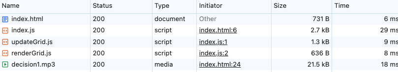
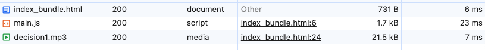

- webpackによるバンドルを実行すると、1ファイルに可能な限り文字を減らして元々のJavaScriptソースを詰め込んだように変換している。MP3ファイル名やaddEventListenerなど圧縮できたらなお良いと思った

- `python -m http.server`でサーバを立てて比較してみた。JavaScriptのソースファイル量が少なくなっているのがわかった
  また転送量は少なくなったが、ロード時間はそんなに速くなっていなかった
  - バンドル前
    - 5 requests
    - 26.9 kB transferred
    - 25.9 kB resources
    - Finish: 95 ms
    - DOMContentLoaded: 69 ms
    - Load: 102 ms
      
  - バンドル後
    - 3 requests
    - 23.9 kB transferred
    - 23.3 kB resources
    - Finish: 77 ms
    - DOMContentLoaded: 51 ms
    - Load: 95 ms
      
